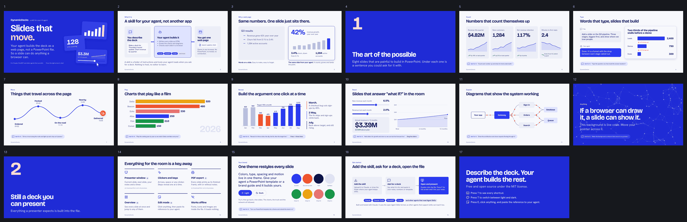
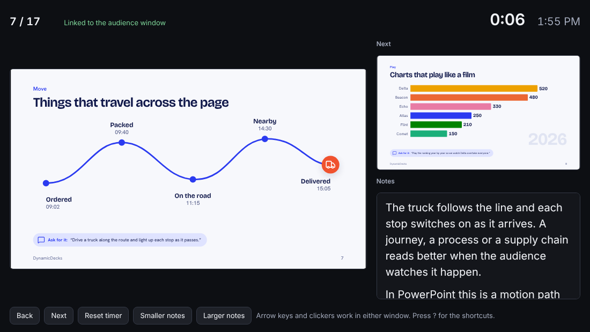
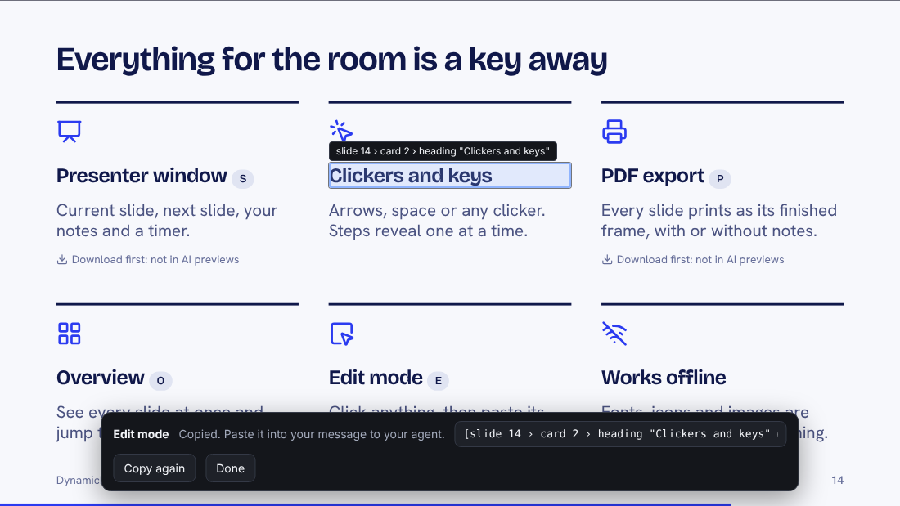
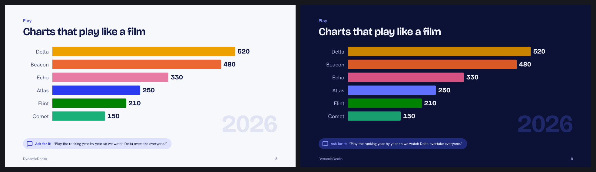

# DynamicDecks

**A skill that teaches your AI agent to build presentations as web pages instead of PowerPoint files.**

Add it to Claude, ChatGPT, Codex or another agent that uses skills. Ask for a deck. The agent writes one `.html` file that opens in any browser, and because it is a web page, the slides can do what PowerPoint makes painful: numbers count up, words type themselves, things travel across the page, charts play like a film, and sliders answer "what if?" live in the room.


**[Open the live showcase](https://pjhprojects.github.io/dynamic-decks-skill/)** and press the right arrow.

Every slide in that clip is live in the browser, with no video and no images. It is the showcase deck that ships with the skill. To see that it really is one self-contained file, download [`examples/dynamic-decks-showcase.html`](examples/dynamic-decks-showcase.html) and double-click it.

## What it is

DynamicDecks is **not an app**. There is nothing to sign up for, host or learn. It is a [skill](https://agentskills.io): a folder of instructions, a small slide engine, a theme and an icon library that an AI agent loads when you ask it for a presentation.

1. **You describe the deck** to the agent you already use, and hand it your notes, numbers or template.
2. **Your agent builds it.** It outlines the argument, writes every slide as HTML, draws the charts and diagrams, then opens the result in a real browser and checks each slide.
3. **You get one web page.** `your-deck.html` holds the slides, fonts, icons and images. Double-click it to present. Send it to anyone.

It is built and tested with **Claude** (the Claude app and Claude Code). It uses the open [Agent Skills](https://agentskills.io) format, which **ChatGPT, Codex**, Gemini CLI, Cursor, GitHub Copilot and many other agents also read, so those can load it too. See [Install](#install) for what has and has not been tested.

## Why a web page instead of a PowerPoint file

Agents write HTML, CSS, SVG and JavaScript precisely. They build `.pptx` files indirectly, through libraries, with limited control over layout and almost none over motion. Asking an agent for PowerPoint tends to get you words on a slide. Asking it for a web page gets you anything a browser can draw, for the same one-sentence request.

So the slides can be dynamic, and a dynamic slide makes the point for you:

| Instead of | The slide can | Ask for it with |
|---|---|---|
| A number in a text box | **Count** the figure up and draw its trend | "Count each number up and draw its trend underneath." |
| A sentence that is just there | **Type** the question out, then build the answer | "Type the question out, then build the answer beside it." |
| A row of boxes and arrows | **Move** something along the route, lighting each stop | "Drive a truck along the route and light up each stop as it passes." |
| A chart of the final year | **Play** the ranking year by year | "Play the ranking year by year so we watch Delta overtake everyone." |
| Everything at once | **Reveal** one chart in the order of your argument | "Reveal it in three clicks: the dip, the fix, then the target line." |
| "I'll get back to you on that" | **React**: sliders recalculate the forecast on the slide | "Add sliders for growth and churn so we can test the forecast live." |
| A static architecture picture | **Explain**: requests flow through the diagram | "Draw the architecture and show requests flowing through it." |
| A stock photo | **Anything**: a background that follows your pointer | "Make the background a network that reacts to my pointer." |

Each row is a slide in the showcase, with that sentence printed underneath it. In PowerPoint each one is an afternoon of motion paths and animation panes, or simply not possible.



And it is still a proper deck: clicker support, speaker notes, a presenter window, PDF export, your brand's theme.

## What you can ask for

> Make a deck for Thursday's board update from the attached notes. Ten slides. Count the headline numbers up and play revenue quarter by quarter.

> On the pricing slide, bring the three tiers in one after another and add a slider for team size that updates the monthly cost.

> Show the onboarding flow as a path a user travels, and light up each step as they reach it.

> Turn this PowerPoint template into a theme and rebuild the deck in it.

> Make [slide 7 › card 2 › heading "Clickers and keys" @7.2.2.2] shorter.

That last one is edit mode: press `E`, click the thing you mean, paste the reference. You never have to describe which element you are talking about.

## Features

### Dynamic slides

- **One attribute for the common moves.** `data-count` counts a number up. `data-type` types text out, without the layout shifting as it arrives. `data-anim` gives `fade`, `rise`, `pop`, `bounce`, `wipe`, `draw` for lines, `grow-up` for bars and `travel` along a path. `data-stagger` cascades a group. `data-step` holds something back until the next click.
- **Anything else, written for you.** Any slide can carry its own HTML, SVG, CSS and JavaScript: canvas, interactive controls, simulations, embedded video. Styles and scripts are scoped to their slide, so one ambitious slide cannot break the others.
- **Interactive without getting in the way.** Clicking a slide advances the deck; clicking a slider, button or link on it does not.
- **Every animation has a still frame.** Slides are written in their finished state and animate toward it, so PDFs, the overview, the presenter's preview and viewers who turn motion off all see the complete slide. The build fails if a slide breaks this.
- **Fifteen ready-made layouts** for the quiet slides in between: title, section, bullets, two-column, big number, stats, cards, chart, image, quote, diagram, table, timeline, closing and full-bleed. The [starter deck](https://pjhprojects.github.io/dynamic-decks-skill/examples/dynamic-decks-starter.html) has one of each.

### Charts, diagrams and images

- **Charts are SVG, drawn from your numbers.** A script computes the geometry for bar charts (upright or sideways, plain or stacked), line and area charts and donuts, so ticks and labels are exact. Colors come from the theme's chart palette, which is checked for color-blind readers.
- **Diagrams are SVG too:** flows, layers, architecture, timelines, in theme colors, able to build step by step or carry moving traffic.
- **Images are embedded.** Point at a local PNG, JPEG, WebP or SVG and the build compresses it and places it inside the file. Video and audio files are embedded the same way.
- **2,122 icons built in.** The [Lucide](https://lucide.dev) set, searchable by meaning ("growth", "security"). Only the icons a deck uses are embedded.

### Presenting

- **Keys and clickers:** arrows, space, Page Up and Page Down, Home and End, a slide number then Enter. Click and swipe also work.
- **Presenter window** (`S`): current slide, next slide, notes, timer and clock, kept in sync with the audience window, with no server.
- **Overview grid** (`O`), **blank screen** (`B`), **full screen** (`F`), **notes on the same screen** (`N`).
- **PDF export:** slides only (`P`), or one page per slide with its notes (`Shift+P`).
- **Deep links:** `deck.html#12` or `deck.html#pricing` opens on that slide.
- **One file, offline.** It makes no network requests. The showcase, with seventeen slides and three embedded fonts, is about 430 KB.

| Presenter window | Edit mode |
|---|---|
|  |  |

### Themes and icons you own

- **Everything is a token.** Colors, fonts, sizes, spacing, radii, shadows and motion speeds are named values. Slides use the names, never raw values, so a theme swap restyles the whole deck, including the custom slides, the charts and the canvas.
- **Light and dark** variants in the built-in theme; press `T` to switch while presenting.
- **Theme from a PowerPoint template.** Give your agent a `.pptx` or `.potx` and it reads the slide master into a theme: colors, fonts and logo, title alignment, where the footer and slide number sit, the bullet style, and which master to use when the file has several. It then draws the template's own slides beside the theme's so the two can be compared before any deck is written.
- **The template's other layouts, by name.** A quote slide, a dark content slide or a divider in the template becomes a background any slide can ask for.
- **Branded backgrounds stay intact.** When a template's background is a photo, a gradient or artwork, down to a logo or a thin rule, it is kept as a picture for each kind of slide (content, title, section, closing) instead of being rebuilt by guesswork. Pictures are drawn at twice the stage size and line artwork is stored without loss, so rules and lettering stay sharp.
- **Text goes where the template puts it.** The template's own title box and text box decide where a deck's title and body sit, so a title stays above the rule drawn under it or on the band drawn behind it, in a color that reads there. The picture is measured once for text color and for whether it needs a panel; slides written later follow those rules without anyone looking at it again.
- **Theme from a brand guide.** Give it your colors and fonts; font files are embedded so the deck looks the same on every machine.
- **Re-theme a finished deck,** or recover the theme from a deck someone sent you.
- **Your own icon set.** Import a folder of SVGs; they are cleaned, made theme-colored and searchable like the built-in set.



### Edit mode

Press `E` and click anything on a slide. A reference such as `[slide 7 › card 2 › heading "Clickers and keys" @7.2.2.2]` is copied to your clipboard. Paste it into your message and the agent finds the exact element in the source. No button sits on screen while you present; the mode exists only when you press the key.

### Checks before you get the file

- **The build refuses** hard-coded colors and fonts, icons that do not exist, slides without speaker notes, anything loaded from the internet, and animation with no still frame.
- **A browser check** opens the finished deck in Chromium, screenshots every slide and flags content that overflows or gets cut off, and text that is hard to read against the pixels really behind it, so the agent looks at each slide before you do.

## DynamicDecks or PowerPoint?

| | DynamicDecks | PowerPoint file |
|---|---|---|
| Made by | Your AI agent, from a description | Your AI agent with limited control, or you by hand |
| Opens with | Any desktop browser | PowerPoint or Keynote |
| Animation and interaction | Anything the web can do | The built-in effects |
| Charts | Drawn from your data as vector graphics; can play, build and respond | Chart objects |
| Restyle a finished deck | Swap the theme and rebuild | Reapply a template, then fix by hand |
| Works offline | Yes, one file | Yes |
| Edit by clicking into a slide | No, ask your agent | Yes |

That last row is the trade. If colleagues need to open the file and retype a number themselves, use PowerPoint. If the deck needs to look and move like nothing PowerPoint can make, use this.

## Install

**Download the skill: [dynamic-decks.zip](https://github.com/pjhprojects/dynamic-decks-skill/releases/latest/download/dynamic-decks.zip).** That one file is what you install. The same archive is on the [latest release](https://github.com/pjhprojects/dynamic-decks-skill/releases/latest) as `dynamic-decks.skill` too.

> **Do not use GitHub's green "Code > Download ZIP" button.** That downloads this whole project, with the skill one folder down, and Claude rejects it with "SKILL.md file must be in the top-level folder". If you already have the project, the skill is the `dynamic-decks` folder inside it: zip that folder, or run `python tools/package.py`.

The agent needs to be able to run code and write files, since the skill's scripts are Python.

**Claude app** (tested). Code execution has to be enabled. Go to Customize > Skills, click "+", then "+ Create skill", choose "Upload a skill", and upload the ZIP. See [Use skills in Claude](https://support.claude.com/en/articles/12512180-use-skills-in-claude) for the current steps.

**Claude Code** (tested). Copy the `dynamic-decks` folder into `~/.claude/skills/` for all projects, or `.claude/skills/` inside one project. See the [Claude Code skills documentation](https://code.claude.com/docs/en/skills).

```bash
git clone https://github.com/pjhprojects/dynamic-decks-skill.git
cp -r dynamic-decks-skill/dynamic-decks ~/.claude/skills/
```

**ChatGPT and Codex** (not yet tested by this project). OpenAI's agents read the same skill format. Their documentation says to place the skill folder in an `.agents/skills` directory, in your repository or your user folder. See [Build skills](https://learn.chatgpt.com/docs/build-skills) for the current steps and for which ChatGPT plans include skills.

```bash
cp -r dynamic-decks-skill/dynamic-decks ~/.agents/skills/
```

**Other agents** (not yet tested). Gemini CLI, Cursor, GitHub Copilot, VS Code, Goose, OpenCode and others support Agent Skills; the [Agent Skills site](https://agentskills.io) links to each one's instructions. Copy the `dynamic-decks` folder to wherever that agent keeps skills. If you try one, please open an issue and say how it went.

Then ask for a deck. The scripts need Python 3.9 or later. Four things are optional, and each script says what it skipped without them: Pillow (image compression, contact sheets and background pictures), Playwright with Chromium (screenshots, overflow and contrast checks, PDF export), fontTools (reading font files when you add a theme) and LibreOffice (drawing a PowerPoint template's backgrounds exactly as designed; without it, photo and gradient backgrounds are still kept, and artwork made of shapes is left out and reported).

## Keys

| Key | Does |
|---|---|
| `→` `Space` `PgDn` | Next |
| `←` `PgUp` | Back |
| `Home` / `End` | First / last slide |
| number, then `Enter` | Go to that slide |
| `F` | Full screen |
| `S` | Presenter window with notes |
| `N` | Notes on the same screen |
| `O` | Overview of all slides |
| `B` | Blank the screen |
| `T` | Switch light and dark |
| `P` / `Shift+P` | Save slides as PDF / print slides with notes |
| `E` | Edit mode: click an element to copy a reference to it |
| `?` or `H` | Show every shortcut |

## How it works

A deck is five layers, and only one changes from deck to deck:

| Layer | What it is | Changes per deck |
|---|---|---|
| Engine | Navigation, steps, typing and counting, presenter window, edit mode, print | No |
| Theme | Colors, type, spacing, motion, logo | Only when you switch themes |
| Icons | The icons the deck uses | Picked by name |
| Layouts | The ready-made slide types | No |
| Content | Your slides, including any custom code they carry | Yes |

The agent writes the content as a small source file. `build.py` checks it and inlines the other four layers into one `.html`. `render.py` opens the result in a browser to screenshot and check it. `unpack.py` turns a built deck back into an editable source, so a deck can be changed or re-themed even when the original source is gone.

The design rule is "constrain the ingredients, not the composition": a slide may look like anything and do anything, as long as it is built from the theme's values. That is how a deck stays consistent while individual slides go wherever the idea needs.

## What is in this repository

```
dynamic-decks/        the skill itself; this folder is what gets installed
  SKILL.md            instructions the agent follows
  engine/             navigation, motion helpers, presenter view, edit mode, print; layouts
  themes/default/     built-in theme and its fonts
  icons/lucide/       built-in icon set
  template/           showcase.src.html (dynamic slides to adapt) and starter.src.html (every layout)
  scripts/            build, check, render, chart, locate, add_theme, add_icons ...
  reference/          detail the agent reads when it needs it
examples/             the showcase and the starter, built and ready to open
index.html            front page of the live site; forwards to the showcase
docs/images/          the pictures on this page
tests/                browser and script tests
tools/                package.py builds the skill; screenshots.py remakes the pictures
```

Themes and icon sets you add are stored outside the skill, in `~/.dynamic-decks` (or `$DYNAMIC_DECKS_HOME`), so updating the skill never overwrites them.

## Develop

```bash
pip install -r requirements-dev.txt
python -m playwright install chromium
python tests/run_all.py          # all tests, about two minutes
python tests/run_all.py edit     # only test files whose name contains "edit"
python tools/package.py          # dist/dynamic-decks.skill, and refreshes the example decks
python tools/screenshots.py      # remakes docs/images (the demo needs ffmpeg)
```

Ideas, bug reports and pull requests are welcome, and so are new showcase slides. See [CONTRIBUTING.md](CONTRIBUTING.md) for the rules the engine and layouts follow, and [CHANGELOG.md](CHANGELOG.md) for what has shipped.

## Limits

- Built and tested with Claude. Other agents that read Agent Skills should be able to use it, but that is untested, and results depend on how well the agent writes HTML and whether it can run the scripts.
- In the preview pane of an AI assistant, the presenter window (`S`) and PDF export (`P`) do not work. Download the file and open it in your browser; the deck says so if you press those keys in a preview.
- Decks are tested in Chromium only (Chrome and Edge share that engine). Firefox and Safari are untested.
- Decks are for desktop browsers. Phones are out of scope.
- Reading PowerPoint templates (backgrounds, title alignment, footers, bullets, extra layouts) is tested on templates made for the tests, some built to reproduce faults reported from a real company template. It has not been run on a wide range of real ones. A theme on a picture background has one look, with no automatic dark variant.
- A theme restyles the fifteen layouts here; it does not recreate PowerPoint's own layouts box for box. The logo goes in the footer unless it is part of a background picture.
- Recipients cannot edit a slide by clicking into it.
- What a slider or other control is set to stays in that window; it is not mirrored to the presenter window.
- Some mail systems block `.html` attachments; zip the file or share a link to it.
- PDF export uses the browser's print engine; Chrome and Edge give the best result. A PDF shows each slide's finished frame, not its motion.

## License

DynamicDecks is open source under the [MIT License](LICENSE).

- **Decks you build are yours.** Each one carries a one-line credit comment for the copy of the engine inside it; leave that in place.
- **Bundled third-party material keeps its own license:** the Lucide icons (ISC, with some icons under MIT from Feather) and the fonts Bricolage Grotesque, Hanken Grotesk and JetBrains Mono (SIL Open Font License 1.1). Details are in [`dynamic-decks/NOTICE.md`](dynamic-decks/NOTICE.md).
- **Themes and icon sets you add are yours** and are not part of this repository.

This project was written with Claude, Anthropic's AI model, under the direction of its maintainer.
